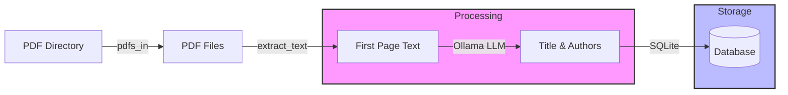

# Ollama Oracle

Ollama Oracle is a Python-based tool that helps manage and extract information from academic papers using the Ollama platform. It automatically extracts titles and authors from PDF papers and stores this information in a SQLite database for easy reference.

## Features

- Automatically extracts paper titles and authors from PDF files
- Uses Ollama LLM for intelligent text extraction
- Stores paper information in a SQLite database
- Supports batch processing of PDF files in a directory tree

## Prerequisites

- Python 3.x
- Ollama server running locally or remotely
- PDF files of academic papers

## Installation

### 1. If you don't have Ollama

1. Install Ollama by following the instructions at [Ollama's official website](https://ollama.ai/download).
2. Once Ollama is installed, pull the required model (default is qwen2.5):
```bash
ollama pull qwen2.5
```

### 2. Clone the Repository

1. Clone the repository:
```bash
git clone https://github.com/romilly/ollama-oracle.git
cd ollama-oracle
```

### 3. Create and Activate a Virtual Environment

1. Create and activate a virtual environment:
```bash
python -m venv venv
source venv/bin/activate  # On Linux/Mac
# or
venv\Scripts\activate     # On Windows
```

### 4. Install Dependencies

1. Install the required dependencies:
```bash
pip install -r requirements.txt
```

### 5. Configure Environment Variables

1. Optionally, create a `.env` file with your configuration. If you don't it will use the defaults below:
```env
OLLAMA_URL=http://localhost:11434
OLLAMA_MODEL=qwen2.5
DIRECTORY=../data/pdfs
```

## Usage

To run the tool after setting up your `.env` file:

```bash
cd src
python ollama_oracle/ollama_oracle.py
```

This will process all PDF files in the directory specified by your `DIRECTORY` environment variable (defaults to `../data/pdfs`).

## How It Works

The tool is specifically designed to work with academic PDFs. Since many academic papers lack proper metadata, Ollama Oracle scans the first page of each PDF and uses an LLM (Large Language Model) to extract the title and authors. This technique works for approximately 99% of academic papers I've tried.

### Data Flow



The diagram shows how:
1. The tool scans a directory tree for PDF files
2. For each PDF, it extracts text from the first page
3. The text is sent to the Ollama LLM to identify the title and authors
4. The extracted information is stored in a SQLite database

## Database Schema

The project uses SQLite to store paper information in a table called `pdf_info` with the following schema:

```sql
CREATE TABLE pdf_info (
    path TEXT PRIMARY KEY,  -- Absolute path to the PDF file
    title TEXT,            -- Title of the paper
    authors TEXT           -- Comma-separated list of authors
);

## Project Structure

- `src/ollama_oracle/` - Main source code
- `data/` - Directory for sample PDF files and other data
- `tests/` - Test files
- `docs/` - Documentation
- `pdf_files.db` - SQLite database storing paper information

## Contributing

Contributions are welcome! Here's how you can help:

1. **Issues**: 
   - Report bugs or suggest features by opening an issue
   - Provide clear descriptions and steps to reproduce any bugs
   - Tag issues appropriately (bug, enhancement, question, etc.)

2. **Pull Requests**:
   - Fork the repository
   - Create a new branch for your feature or fix
   - Make your changes and test them thoroughly
   - Submit a pull request with a clear description of your changes
   - Link any related issues in your pull request

Please ensure your contributions align with the project's MIT license.

## License

This project is licensed under the MIT License - see the [LICENSE](LICENSE) file for details.

## Author

Copyright (c) 2025 Romilly Cocking

## Questions?

Before running the project, I have a few questions to help improve this documentation:

1. Are there any specific format requirements for the PDF files?
2. Should there be any documentation about the database schema?
3. Are there any specific setup instructions for the Ollama server?
4. Would you like to add any information about contributing to the project?
